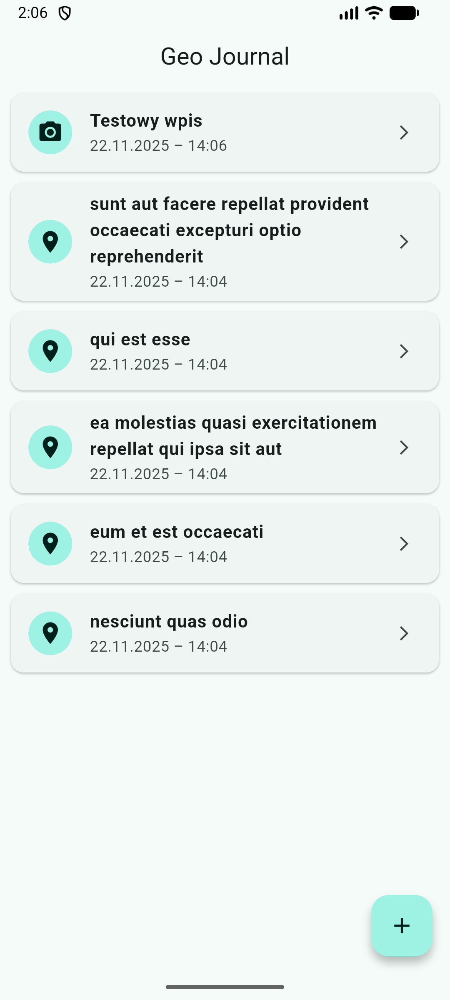
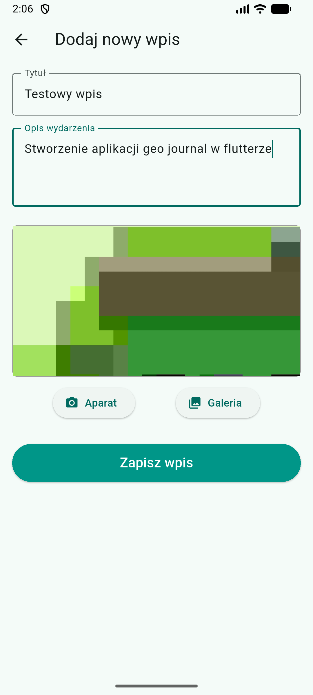
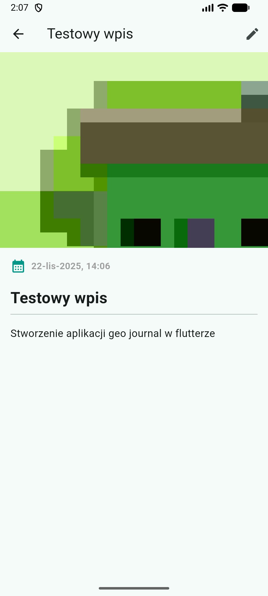

# Flutter App - Geo Journal

Aplikacja moblina "Geo Journal", stworzona we Flutterze, pozwala użytkownikow na zapisanie wspomnień w loklanym dzienniku wraz z opisem, datą oraz zdjęciem

## Spełnione wymagania funkcjonalności

Aplikacja implementuje wszystkie kluczowe wymagania:

* **Implementacja Widoków (3):**
    1.  **Lista Wpisów (`lib/screens/home_screen.tsx`):** Główny ekran wyświetlający listę wpisów pobranych z API oraz tych dodanych lokalnie przez użytkownika. Obsługuje stany ładowania, błędów oraz pustej listy.
    2.  **Szczegóły Wpisu (`lib/screens/entry_details_screen.dart`):** Ekran dynamiczny, wyświetlający pełny opis, datę oraz zdjęcie. Widok Szczegółowy zawiera również przycisk edycji dzięki czemu użytkownik może edytować wpisy.
    3.  **Formularz Dodaj/Edytuj (`lib/screens/add_entry_screen.dart`):** Uniwersalny formularz obsługujący dwie funkcje: tworzenie nowego wpisu oraz edycję istniejącego.

* **Integracja z API**
    Aplikacja komunikuje się z testowym API `jsonplaceholder.typicode.com`.
    * **GET:** Pobieranie listy startowej z `jsonplaceholder.typicode.com/posts` (limit 5 wpisów).
    * **POST:**  Dodawanie nowego wpisu.
    * **PUT:** Aktualizacja istniejącego wpisu.
    * **Fallback:** Zaimplementowano mechanizm dzięki któremu error 403 lub brak sieci nie będą problemem i pozwolą użytkownikowi na dalsze korzystanie z aplikacji. Aplikacja w takim przypadku przetwarza dane lokalnie.

* **Funkcja Natywna** - **`image_picker`**.
   1.  **Uzasadnienie wyboru:** Możliwość dokumentowania podróży za pomocą zdjęć jest kluczowa dla aplikacji typu "Geo Journal".
   2.  **Implementacja:** Aplikacja pozwala użytkownikowi na zrobienie zdjęcia aparatem lub wybranie go z galerii telefonu podczas dodawania lub edycji wpisu. Wpis zawierający zdjęcie jest można rozróżnić na liście poprzez ikonkę aparatu. Aby zobaczyć zdjęcie należy kliknąć w wpis który ma ikonkę aparatu, to przenesie nas do szczegółowego widoku wpisu gdzie znajduje się zdjęcie.

## Technologie i Biblioteki

* **Flutter & Dart**
* `http` - obsługa zapytań sieciowych.
* `image_picker` - obsługa aparatu i galerii.
* `intl` - formatowanie dat i czasu.
* `uuid` - generowanie unikalnych identyfikatorów dla nowych wpisów.

## Uruchamianie Projektu

Projekt został stworzony i testowany w **VS Code** przy wsparciu **Android Studio** (do zarządzania emulatorem).

0.  Upewnij się, że masz zainstalowane Flutter SDK oraz skonfigurowane środowisko.
1.  Sklonuj repozytorim
2.  W głównym folderze projektu przejdź do folderu `flutter_geo_journal` i pobierz zależności:
    ```bash
    flutter pub get
    ```
3.  Uruchom emulator:
    ```bash
    flutter emulators --launch Medium_Phone_API_36.1 

    (przykładowy emulator używany w projekcie)
    ```
    
4.  Gdy emulator się uruchomi, wystartuj aplikację:
    ```bash
    flutter run
    ```
## Galeria

| Ekran Główny | Dodawanie / Edycja | Szczegóły Wpisu |
|:------------:|:------------------:|:---------------:|
|  |  |  |